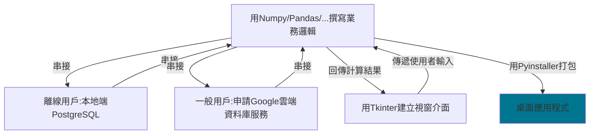

# 2022/07/06 家教課綱
###### tags:`Tutor`
<!-- ## Tutorial Fee Pricing

- 5K for prototype
- 500TWD/15min for consulting
    - If exceeds 15 min, will be accumulated to next time. -->

<!-- [中文版(尚未翻譯)](https://hackmd.io/LhhZLKpMRHWYB66JnWpK4w)    
[English version]()     -->
## Contents(目錄)
### 收費標準
- 以總額十萬元新台幣為計:
    - 教學/諮詢部分，暫以共30小時時數來預估，教學/諮詢費用以一小時1200元新台幣為計算，預計共收取36000元新台幣:
        - 每次上課後結算上課時數，每個月支付之前累計費用。
        - 待專案完成預期基本功能後，需付清總額36000元新台幣之費用。
        - 若我因他因未能完成專案預期基本功能，則只需支付之前累積時數之費用。
    - 專案基本功能部分，需共收取74000元新台幣:
        - 先預支一半金額37000元新台幣。
        - 若完成預期功能(這部分需再度確認)，需支付剩下37000元新台幣。若我因他因未能完成專案預期基本功能，則不需支付剩下37000元新台幣之費用。

---

- 預期進度
    - 預期年底結束 詳細進度待上過一兩堂之後再訂
    - 第一堂課進度
        - 安裝開發環境
            - Python/Anaconda
                - [Anaconda官網下載頁面](https://www.anaconda.com/products/distribution)
            - 使用Jupyter Notebook/Vscode/命令列中開發Python
                - 建立conda virtual environment
            - 從登入頁面之GUI/邏輯之基本範例程式中學習python基本語法
                - 程式範例一: Login_GUI.ipynb
                    - [Label.grid():布局管理器](https://www.cnblogs.com/ruo-li-suo-yi/p/7425307.html)
                - 程式範例二:登入邏輯.ipynb
                    - [進階知識，選讀][字串前面的b是甚麼意思(b"xxx")](https://stackoverflow.com/questions/6269765/what-does-the-b-character-do-in-front-of-a-string-literal): bytestring
                    - [進階知識，選讀][hashlib官方文件](https://docs.python.org/3/library/hashlib.html)
- 參考資源
    - 如何善用Google翻譯Chrome插件
    <!--     - Cloud Service  -->
    <!--     - Javascript Desktop Application -->
    - Database<!--     - Flask Server -->
    - Packaging Tool(打包工具)
    - GUI
    - 實作範例
- 額外支線(視進度選擇是否要教)
    - PLD(可程式化邏輯裝置)
    - ChatBot(聊天機器人)
    - FoodPanda/UberEat API
---

## Expected Workflow (預期流程)

## Tutorial Reference (參考資源)

### 如何善用Google翻譯Chrome插件

- [插件安裝連結](https://chrome.google.com/webstore/detail/google-translate/aapbdbdomjkkjkaonfhkkikfgjllcleb?hl=zh-TW)

### GUI

- [Tkinter教學](https://ithelp.ithome.com.tw/articles/10247294?fbclid=IwAR1g5fNw29VEJpsVoptiQbkH7juvfdS3MzgmpW5Ce_quCLEb8aO6JhvahmM)
- 常見問題:
    - [如何將label居中](https://www.tutorialspoint.com/how-to-center-a-label-in-a-frame-of-fixed-size-in-tkinter)
    - [Change Icon in Tkinter](https://stackoverflow.com/questions/33137829/how-to-replace-the-icon-in-a-tkinter-app)
    - [Tkinter的mainloop該如何理解?](https://www.zhihu.com/question/23542885)

### Cloud Service (雲端服務)

- [**Google Cloud Database**](https://cloud.google.com/products/databases?hl=zh-tw)(完成請打勾)
<!-- - 其他相關資料(選讀)
    - [Heroku vs GCP](https://blog.typeart.cc/heroku-vs-gcp/)
    - GCE and GAE
    - Heroku itself is deployed on AWS
    - [GCP VM](https://blog.cloud-ace.tw/infrastructure/vm/start-a-google-vm-compute-engine/)
    - [GCP free plan vm](https://andrewintw.github.io/create-a-vps-on-google-compute-engine/) -->

<!-- ### Javascript Desktop Application

- [Electron](https://www.youtube.com/watch?v=3yqDxhR2XxE)

- [Node.js Router](https://developer.mozilla.org/zh-TW/docs/Learn/Server-side/Express_Nodejs/routes)
 -->
### Packaging Tool (打包工具)

- [pyinstaller](https://ithelp.ithome.com.tw/articles/10261688?sc=iThelpR)

### DataBase (資料庫)

<!-- - [PostgreSQL on Heroku](https://ithelp.ithome.com.tw/articles/10219773?sc=pt) -->
- [Python connect to PostgreSQL](http://tw.gitbook.net/postgresql/2013080998.html)

<!-- ### Flask Server

- [Router](https://clay-atlas.com/blog/2020/02/21/python-flask-chinese-notes-route-page/)
- [HTML renderer](https://ithelp.ithome.com.tw/articles/10234106) -->

### 實作範例

- [登入系統邏輯](https://medium.com/@moinahmedbgbn/a-basic-login-system-with-python-746a64dc88d6)
    - 使用hashlib加密套件

---

## 支線

### FoodPanda/UberEat API

- [FoodPanda Spider](https://blog.jiatool.com/posts/foodpanda_spider/)
- [UberEat API](https://developer.uber.com/docs/eats/introduction)

### ChatBot

- [LineBot deployed on Heroku](https://datasciocean.tech/others/create-first-line-bot/)

<!-- ### GUI

[Cross-Platform GUI](https://ithelp.ithome.com.tw/articles/10208009) -->

### PLD

- [Arduino Automatic Plant Watering System](https://create.arduino.cc/projecthub/neetithakur/automatic-plant-watering-system-using-arduino-uno-8764ba)

