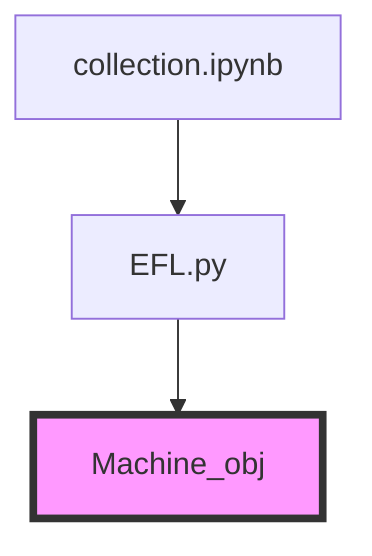

# RTN
> 2022/07/25 Kevinkuo

TODO:eyes:: autogen same title with file name

[circuit optimization](https://quantumai.google/cirq/tutorials/google/spin_echoes)
[drop empty moments](https://quantumai.google/reference/python/cirq/drop_empty_moments?authuser=4)
[cirq2tn notbook](https://colab.research.google.com/drive/18D9hKXkGZl7sCNyPYvStDnfhQCNjxMMk?authuser=1#scrollTo=HWosqT5wFZqn)

```bash=
KeyError                                  Traceback (most recent call last)
<ipython-input-18-6be22610ffb5> in <module>()
----> 1 rho_tn = ccq.tensor_density_matrix(circuit, qubits)
      2 rho_cirq = cirq.final_density_matrix(circuit, qubit_order=qubits)
      3 np.testing.assert_allclose(rho_cirq, rho_tn, atol=1e-5)

6 frames
/usr/local/lib/python3.7/dist-packages/quimb/tensor/tensor_core.py in <genexpr>(.0)
   3837         }[which]
   3838 
-> 3839         tid_sets = tuple(xmap[x] for x in xs)
   3840         if not tid_sets:
   3841             tids = oset()

KeyError: 'i13b'
```

```bash=
---------------------------------------------------------------------------
KeyError                                  Traceback (most recent call last)
<ipython-input-26-7ea799236ec8> in <module>()
      2 for n_qubits in [3, 6]:
      3     for n_moments in list(range(1, 500, 50)):
----> 4         record = profile(n_qubits=n_qubits, n_moments=n_moments)
      5         records.append(record)
      6         print('.', end='', flush=True)

9 frames
<timeit-src> in inner(_it, _timer)

/usr/local/lib/python3.7/dist-packages/quimb/tensor/tensor_core.py in <genexpr>(.0)
   3837         }[which]
   3838 
-> 3839         tid_sets = tuple(xmap[x] for x in xs)
   3840         if not tid_sets:
   3841             tids = oset()

KeyError: 'i1b'
```



```python=
class Machine(object):
    def __init__(self, model, system, method='weighted'):
                         (self.__class__.__name__, attr))
    # build machine
    def build(self):
        if not self._built: # if not built
``

meaning of `-u` in git argument, see [discussion](https://stackoverflow.com/questions/5697750/what-exactly-does-the-u-do-git-push-u-origin-master-vs-git-push-origin-ma)